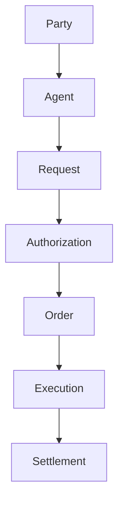

# SAIF Protocol

> [!IMPORTANT]
> **Project status: PAUSED / FROZEN since 2026-08-16.** Active protocol development is suspended. Existing specifications, branches, and history are preserved; only critical maintenance and preservation work should continue. See [PROJECT_STATUS.md](PROJECT_STATUS.md) for the rationale, freeze policy, and conditions to resume.

**Enable AI to participate in the real world.**

**让 AI 走进现实**

SAIF Protocol is an open standard for defining how AI agents interact with authorized business processes and real-world execution systems.

## Overview

SAIF Protocol defines how AI agents express business requirements, receive authorization from humans or organizations, create business commitments, interact with execution providers, and record settlement outcomes through structured, interoperable objects.

SAIF is protocol-first, provider-independent, and AI-vendor-neutral. It does not treat an AI agent as an independent legal or financial owner. A human or organization remains the accountable party and authorizes the agent to act within a defined scope.

MCP is an integration and transport mechanism.

MCP is not SAIF itself.

## Scope

SAIF Business Object Model v0.1 defines:

- the core objects used in AI-native economic activity;
- the lifecycle from business request to settlement;
- a common interface model for execution providers;
- JSON Schema Draft 2020-12 definitions; and
- example requests for commerce and document services.

This version is a public protocol foundation. It does not implement wallets, payment processing, marketplaces, user systems, or MCP connectors.

## Architecture

SAIF defines the lifecycle:

```text
Party
  ↓
Agent
  ↓
Request
  ↓
Authorization
  ↓
Order
  ↓
Execution
  ↓
Settlement
```



The objects separate four concerns:

- **Intelligence:** the Agent interprets intent and creates a structured Request.
- **Authorization:** a human or organization permits the Agent to act within limits and rules.
- **Execution:** a provider fulfills an authorized Order in the real world.
- **Settlement:** the final financial or accounting outcome is represented without prescribing a payment implementation.

SAIF is not an AI model, payment provider, or marketplace.

SAIF defines the standard interaction model between AI agents and real-world execution systems.

## Core Concepts

| Object | Purpose |
| --- | --- |
| Party | Represents a real-world individual, organization, AI system, or service provider. |
| Agent | Represents an AI execution entity acting for an owner. |
| Request | Represents a structured business requirement. |
| Authorization | Represents permission, scope, limits, and rules for Agent activity. |
| Order | Represents a business commitment generated from an authorized Request. |
| Execution | Represents provider activity and real-world execution status. |
| Settlement | Represents the final payment, refund, invoice, or accounting outcome. |

Every v0.1 object contains a common protocol envelope: `id`, `type`, `created_at`, and `metadata`.

## Documentation

- [Business Object Model](docs/business-object-model.md)
- [Request Lifecycle](docs/request-lifecycle.md)
- [Provider Interface](docs/provider-interface.md)
- [Protocol Versioning Strategy](docs/protocol-versioning.md)
- [Protocol State Model](docs/state-machine.md)
- [SAIF Protocol and MCP Boundary](docs/saif-mcp-boundary.md)
- [Conformance Test Vector Specification](docs/conformance.md)
- [Extension Proposal Process](docs/proposal-process.md)
- [Standard Error Model](docs/error-model.md)
- [Audit Event Model](docs/audit-event-model.md)
- [JSON Schemas](schemas/)
- [Conformance Vectors](conformance/)
- [Examples](examples/)

## Protocol Governance

SAIF Protocol follows explicit versioning, lifecycle models and compatibility principles.

Normative objects, state transitions, schemas, examples, and transport bindings must identify their applicable SAIF version. Changes are classified as Major, Minor, or Patch according to their compatibility impact. Provider extensions must preserve the semantics and reference chain of the public core model.

Governance specifications:

- [Versioning and compatibility](docs/protocol-versioning.md)
- [Standard object state machines](docs/state-machine.md)
- [Boundary between SAIF and MCP](docs/saif-mcp-boundary.md)
- [Cross-implementation conformance](docs/conformance.md)
- [Public extension proposals](docs/proposal-process.md)
- [Standard errors](docs/error-model.md)
- [Portable audit events](docs/audit-event-model.md)

## Standards Roadmap

> **Roadmap status:** frozen. The entries below are historical targets and are not active commitments while the project is paused.

### v0.1

Business Object Model

### v0.2

Lifecycle, Compatibility, Conformance, and Extension Governance

### v0.3

Transport Bindings

### v1.0

Stable Protocol Specification

## Design Principles

- **Open Standard:** public semantics and compatibility rules.
- **Vendor Neutral:** no dependency on a specific AI vendor.
- **Transport Independent:** integrations such as MCP do not define SAIF itself.
- **Authorization Aware:** every action preserves accountable authorization context.
- **Real-World Execution:** the protocol models execution outcomes without prescribing provider implementation.

SAIF Protocol contains no commercial implementation, payment logic, or authentication-provider dependency.

## Repository Structure

- `docs/` — normative model and lifecycle documentation;
- `schemas/` — JSON Schema Draft 2020-12 object definitions;
- `examples/` — example SAIF business requests;
- `conformance/` — implementation-independent valid and invalid test vectors;
- `whitepaper/` — project vision and authorization model;
- `protocol/` — earlier protocol exploration;
- `architecture/` — system architecture notes;
- `demo/` — Agent Commerce Sandbox Demo specification; and
- `roadmap/` — staged development roadmap.

## Status

SAIF Protocol is **paused/frozen as of 2026-08-16**. The currently published v0.2 materials remain an early public specification covering the Business Object Model, lifecycle states, compatibility, conformance, extensions, errors, audit events, and protocol boundaries. It is not production software, a runtime, an MCP Adapter, a payment service, a marketplace, or legal advice. See [PROJECT_STATUS.md](PROJECT_STATUS.md) before proposing new development.
