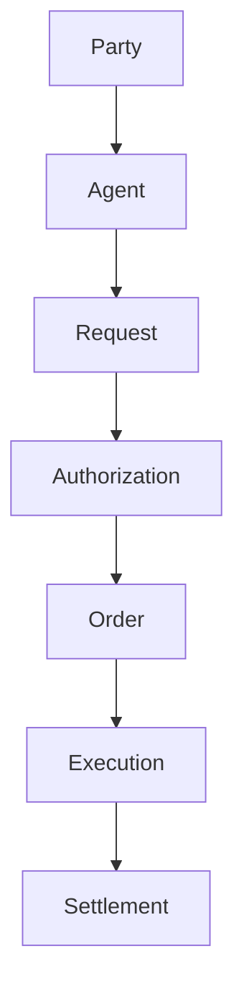

# SAIF Protocol

## An open standard defining business object models and execution frameworks for AI agents interacting with the real economy.

SAIF Protocol defines how AI agents express business requirements, receive authorization from humans or organizations, create business commitments, interact with execution providers, and record settlement outcomes through structured, interoperable objects.

SAIF is protocol-first, provider-independent, and AI-vendor-neutral. It does not treat an AI agent as an independent legal or financial owner. A human or organization remains the accountable party and authorizes the agent to act within a defined scope.

## Scope

SAIF Business Object Model v0.1 defines:

- the core objects used in AI-native economic activity;
- the lifecycle from business request to settlement;
- a common interface model for execution providers;
- JSON Schema Draft 2020-12 definitions; and
- example requests for commerce and document services.

This version is a public protocol foundation. It does not implement wallets, payment processing, marketplaces, user systems, or MCP connectors.

## Core Business Model

SAIF defines the lifecycle:

```text
Party
  ↓
Agent
  ↓
Request
  ↓
Authorization
  ↓
Order
  ↓
Execution
  ↓
Settlement
```



The objects separate four concerns:

- **Intelligence:** the Agent interprets intent and creates a structured Request.
- **Authorization:** a human or organization permits the Agent to act within limits and rules.
- **Execution:** a provider fulfills an authorized Order in the real world.
- **Settlement:** the final financial or accounting outcome is represented without prescribing a payment implementation.

SAIF is not an AI model, payment provider, or marketplace.

SAIF defines the standard interaction model between AI agents and real-world execution systems.

## Core Objects

| Object | Purpose |
| --- | --- |
| Party | Represents a real-world individual, organization, AI system, or service provider. |
| Agent | Represents an AI execution entity acting for an owner. |
| Request | Represents a structured business requirement. |
| Authorization | Represents permission, scope, limits, and rules for Agent activity. |
| Order | Represents a business commitment generated from an authorized Request. |
| Execution | Represents provider activity and real-world execution status. |
| Settlement | Represents the final payment, refund, invoice, or accounting outcome. |

Every v0.1 object contains a common protocol envelope: `id`, `type`, `created_at`, and `metadata`.

## Documentation

- [Business Object Model](docs/business-object-model.md)
- [Request Lifecycle](docs/request-lifecycle.md)
- [Provider Interface](docs/provider-interface.md)
- [JSON Schemas](schemas/)
- [Examples](examples/)

## Design Principles

1. Protocol first.
2. Provider independent.
3. AI vendor neutral.
4. Human/Organization authorization based.
5. Future compatible with commerce, payment, and robotics.

## Repository Structure

- `docs/` — normative model and lifecycle documentation;
- `schemas/` — JSON Schema Draft 2020-12 object definitions;
- `examples/` — example SAIF business requests;
- `whitepaper/` — project vision and authorization model;
- `protocol/` — earlier protocol exploration;
- `architecture/` — system architecture notes;
- `demo/` — Agent Commerce Sandbox Demo specification; and
- `roadmap/` — staged development roadmap.

## Status

SAIF Business Object Model v0.1 is an early public specification. It is not production software, a payment service, a marketplace, or legal advice.
