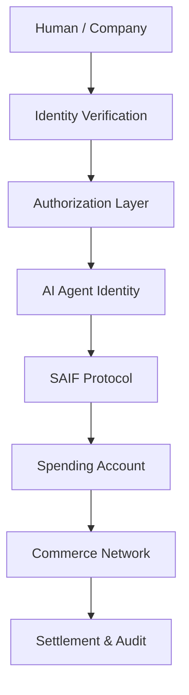

# SAIF Architecture Overview

## Authorized Economic Execution Stack

SAIF sits between owner authorization and real-world commerce. The architecture keeps identity, funding ownership, and accountability with the human or company while enabling an AI agent or autonomous machine to execute approved activities.

```text
Human / Company
       ↓
Identity Verification
       ↓
Authorization Layer
       ↓
AI Agent Identity
       ↓
SAIF Protocol
       ↓
Spending Account
       ↓
Commerce Network
       ↓
Settlement & Audit
```



## Layer Responsibilities

### Human / Company

The human or company is the legal and economic owner. It defines the intended activity, supplies or controls funds, approves policy, and remains accountable for authorized outcomes.

### Identity Verification

This layer verifies the natural person or legal entity that owns the account relationship and issues authorization. It also supports lifecycle events such as changes in control, suspension, and recovery.

Key outputs:

- verified owner identifier;
- owner type and verification method;
- account or organization relationship; and
- status and jurisdictional context where required.

### Authorization Layer

This layer converts owner intent into machine-enforceable delegation.

It defines:

- permitted actions and categories;
- transaction and period limits;
- approved or restricted counterparties;
- approval thresholds;
- validity periods; and
- revocation conditions.

The layer issues a decision or proof that SAIF can verify. An agent cannot grant itself additional authority.

### AI Agent Identity

The AI agent identity represents the authorized executor. It binds an agent ID to an owner ID, authorization scope, budget profile, risk rules, and transaction history reference.

The identity does not make the agent a legal owner or give it unrestricted access to owner credentials.

### SAIF Protocol

The SAIF Protocol receives an economic intent from the agent and evaluates it against identity, authorization, budget, and risk policy.

Core functions:

- resolve owner and agent identity references;
- verify authorization proofs and current status;
- normalize quote, order, payment, and service intents;
- apply budget and risk rules;
- obtain additional approval where required;
- route approved requests; and
- emit linked audit events.

### Spending Account

The spending account is a programmable capability layer funded or controlled by the owner. It exposes bounded purchasing power rather than unrestricted custody credentials.

Core functions:

- report available authorized budget;
- reserve funds during execution;
- enforce per-transaction and period limits;
- isolate wallet or payment credentials from the agent;
- release or capture reservations; and
- associate spending with the correct owner, budget, and cost center.

### Commerce Network

The commerce network includes:

- merchant APIs;
- enterprise procurement systems;
- digital services;
- subscription platforms;
- maintenance providers; and
- other product or service marketplaces.

Connectors translate SAIF requests into provider-specific operations and return structured quotes, orders, fulfillment events, refunds, and receipts.

### Settlement & Audit

This layer records the financial and accountability outcome.

It links:

- the verified owner;
- the acting agent;
- the authorization decision;
- the budget reservation;
- the commerce transaction;
- the settlement result; and
- the receipt or accounting reference.

## Reference Execution Flow

1. A human or company completes identity verification.
2. The owner registers an AI agent identity and defines its authorization.
3. The owner funds or assigns a spending account with budget and risk rules.
4. The agent prepares an economic intent, such as renewing approved software.
5. SAIF verifies identity status, authorization scope, remaining budget, and risk controls.
6. If required, SAIF requests and records additional owner approval.
7. The spending account reserves the authorized amount.
8. SAIF routes the request to the commerce network.
9. The provider completes or rejects the order, service, or payment operation.
10. SAIF captures or releases the reservation and records settlement and audit evidence.

## Trust Boundaries

- The agent is not trusted with unrestricted owner payment credentials.
- Owner verification is distinct from agent identification.
- Authorization is validated at the SAIF boundary, not accepted solely from agent input.
- Policy and budget are checked before a commerce request becomes binding.
- Connectors isolate provider credentials and sensitive payment data.
- Settlement evidence is linked to the authorization and acting agent.
- Owners can suspend agents and revoke authorization independently of agent state.

## v0.1.1 Scope

This architecture is conceptual and provider-neutral. It defines the control flow for owner-authorized economic activity without prescribing a bank, wallet, payment rail, identity provider, commerce platform, or accounting system.
