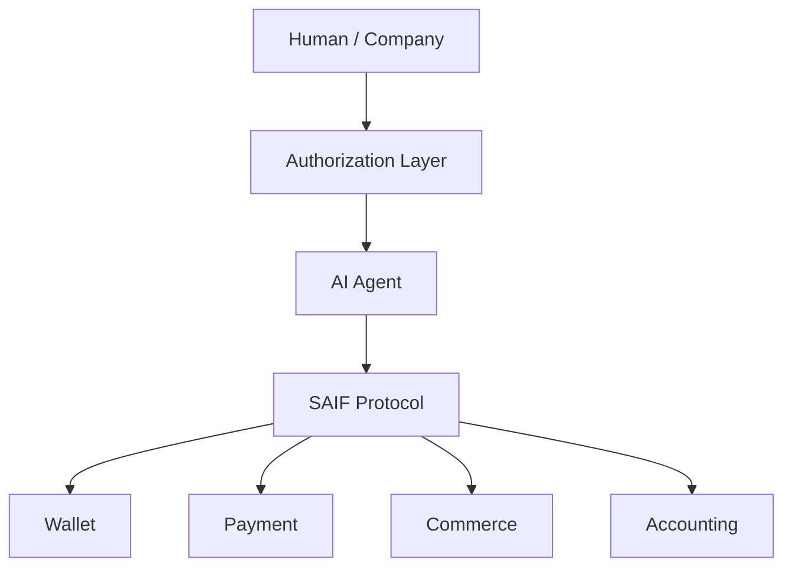

# SAIF Architecture Overview

## System Context

SAIF sits between delegated human or company intent and the financial systems that execute and record economic activity.

```text
Human / Company
       ↓
Authorization Layer
       ↓
AI Agent
       ↓
SAIF Protocol
       ↓
Wallet / Payment / Commerce / Accounting
```



## Layer Responsibilities

### Human / Company

The human or company is the accountable principal. It creates or sponsors the agent financial identity, defines policy, funds budgets, reviews activity, and retains suspension and revocation authority.

Key responsibilities:

- verify the owner identity;
- register or approve the agent;
- define business intent and risk appetite;
- fund or assign financial resources; and
- accept legal and operational accountability where applicable.

### Authorization Layer

The authorization layer converts owner intent into enforceable, machine-readable permissions. It evaluates whether a requested action is allowed before any financial commitment occurs.

Key responsibilities:

- issue scoped and time-bound grants;
- enforce least-privilege access;
- evaluate transaction limits and counterparty policies;
- request human approval when required;
- support suspension, revocation, and key rotation; and
- produce signed authorization decisions for audit.

### AI Agent

The AI agent interprets goals, plans actions, selects tools or counterparties, and submits economic requests. It does not bypass policy or directly control unrestricted financial credentials.

Key responsibilities:

- identify itself on every protocol request;
- present the relevant authorization grant;
- request quotes or transactions within scope;
- handle denials and approval challenges safely; and
- report outcomes to the owner and its task environment.

### SAIF Protocol

The SAIF Protocol is the interoperability and control layer. It provides common models and messages that connect agent identity and authorization to budgets, risk evaluation, transaction execution, and audit evidence.

Core protocol services:

- agent financial identity resolution;
- authorization proof verification;
- budget checks and fund reservation;
- risk and policy evaluation;
- transaction intent normalization;
- connector routing;
- receipts, audit events, and reconciliation references; and
- reputation signal generation based on verifiable outcomes.

### Wallet / Payment / Commerce / Accounting

Existing financial and commercial systems remain the systems of execution and record.

- **Wallets** hold assets and sign or submit transfers.
- **Payment systems** authorize, clear, settle, refund, and dispute payments.
- **Commerce systems** provide catalogs, quotes, orders, invoices, subscriptions, and fulfillment state.
- **Accounting systems** record obligations, expenses, revenue, tax context, and reconciliation results.

SAIF connectors adapt protocol requests to these systems without exposing unrestricted credentials to the agent.

## Reference Transaction Flow

1. A human or company creates an agent identity and delegates a scoped authority.
2. The AI agent develops a transaction intent, such as purchasing an approved service.
3. The agent sends the intent, identity reference, and authorization proof to SAIF.
4. SAIF resolves the identity and verifies status, owner, scope, budget, and risk controls.
5. If policy requires approval, the authorization layer challenges the owner and records the decision.
6. SAIF reserves the budget and routes an approved request through the appropriate connector.
7. The wallet, payment, or commerce system executes or rejects the transaction.
8. SAIF records the outcome, releases or captures the budget reservation, and emits an audit receipt.
9. The accounting system receives a reconciliation reference and the owner receives a result notification.

## Trust Boundaries

- The agent is not trusted with unrestricted payment credentials.
- Connector credentials are isolated from agent prompts and tool output.
- Authorization decisions are validated at the protocol boundary, not accepted solely from the agent.
- Budget checks and transaction execution are linked to prevent race conditions and double spending.
- Sensitive transaction data is minimized and disclosed only to authorized participants.
- Every material state transition produces tamper-evident audit evidence.

## v0.1 Scope

The v0.1 architecture is conceptual. It defines layers, responsibilities, and control points; it does not prescribe a specific blockchain, wallet provider, payment rail, identity system, or accounting platform.
