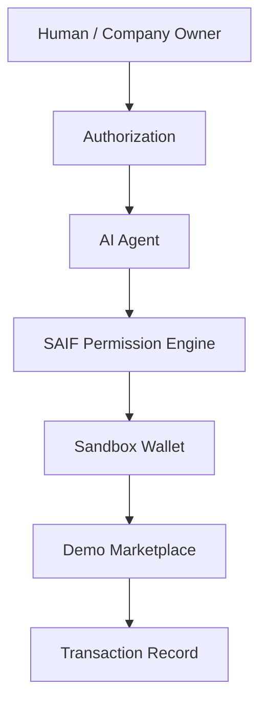

# SAIF Agent Commerce Demo

This demo demonstrates how AI Agents can perform authorized commerce transactions through Standard AI Finance infrastructure.

The demo follows the SAIF Human / Company Authorization Model. A human or legal entity remains the owner of the account, budget, and commercial relationship. The AI Agent acts only as an authorized economic executor within the permissions defined by that owner.

## Core Flow

```text
Human / Company Owner
          ↓
Authorization
          ↓
AI Agent
          ↓
SAIF Permission Engine
          ↓
Sandbox Wallet
          ↓
Demo Marketplace
          ↓
Transaction Record
```



## Demo Goals

The demo shows how an AI Agent can:

- receive authorization from a human or company owner;
- check whether a requested action is permitted;
- use an owner-defined sandbox budget;
- execute a simulated purchase; and
- generate an attributable transaction record.

## Sandbox Boundary

**This is a sandbox demonstration.**

**No real payment processing is involved.**

All identities, permissions, wallet balances, products, orders, and transaction records are demo data. The Sandbox Wallet does not custody real assets, and the Demo Marketplace does not fulfill real products or services.

## Demo Components

- **Authorization Layer:** captures the owner’s permissions and budget limits.
- **AI Agent Identity:** links the acting Agent ID to its Owner ID and Agent Type.
- **SAIF Permission Engine:** evaluates category permission, transaction limits, and available budget.
- **Sandbox Wallet:** simulates balances, reservations, and spending.
- **Demo Marketplace:** accepts approved simulated commerce requests.
- **Transaction Record:** records who authorized the action, which agent acted, what was purchased, and the outcome.

## Documentation

- [Architecture](architecture.md)
- [Sandbox API Specification](api-spec.md)
- [Commerce Scenarios](scenarios.md)

## Demo Status

Version `v0.1` defines the public demo flow, architecture, API contract, and initial scenarios. It is a specification for a future executable sandbox implementation.
