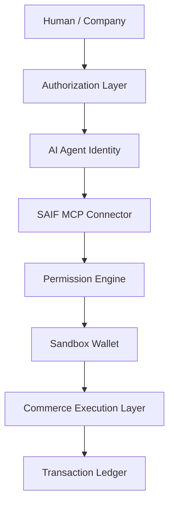

# SAIF Agent Commerce Architecture

## Architecture

```text
Human / Company
        |
Authorization Layer
        |
AI Agent Identity
        |
SAIF MCP Connector
        |
Permission Engine
        |
Sandbox Wallet
        |
Commerce Execution Layer
        |
Transaction Ledger
```



The architecture separates the AI Agent from account ownership and payment custody. The human or company remains the owner. The AI Agent submits an economic request, while SAIF verifies the delegation and controls whether that request may reach the sandbox commerce system.

## 1. Authorization Layer

Responsible for:

- user or company authorization;
- permission scope; and
- budget limits.

An authorization defines the categories and actions an Agent may use. It may also define single-transaction limits, monthly limits, approval requirements, and revocation status.

## 2. AI Agent Identity

Records:

- Agent ID;
- Owner ID; and
- Agent Type.

The identity connects each request to the acting Agent and the accountable owner. It does not make the Agent an independent legal or financial owner.

## 3. SAIF MCP Connector

Provides a controlled interface between the AI Agent and SAIF services. It converts an Agent tool call into a structured commerce request without exposing Sandbox Wallet credentials or internal marketplace access to the Agent.

## 4. Permission Engine

Determines:

- whether the purchase is allowed;
- whether the amount exceeds a transaction or monthly limit; and
- whether the product matches an authorized category.

The Permission Engine denies the request by default if Agent identity, owner authorization, category permission, or budget information cannot be verified.

## 5. Sandbox Wallet

Simulates:

- available balance;
- spending limits; and
- transaction status.

The wallet reserves and deducts demo balances only after the Permission Engine approves a request. It never holds or transfers real funds.

## 6. Commerce Execution Layer

Connects approved requests to the Demo Marketplace. It resolves product information, creates a simulated order, and returns a structured commerce result.

The Commerce Execution Layer does not accept a direct purchase request that lacks a valid SAIF permission decision.

## 7. Transaction Ledger

Records:

- who authorized the activity;
- which Agent executed it;
- what was purchased;
- the amount; and
- the time of the transaction.

The ledger also stores the permission decision, wallet result, transaction status, and marketplace order reference so the complete simulated action can be audited.

## Purchase Sequence

1. A human or company creates an Agent and defines its permissions and monthly budget.
2. The AI Agent submits a purchase request through the SAIF MCP Connector.
3. The Permission Engine verifies Agent Identity and Owner Authorization.
4. The Permission Engine checks category permission, transaction limit, and remaining budget.
5. The Sandbox Wallet confirms and reserves the required demo balance.
6. The Commerce Execution Layer creates an order in the Demo Marketplace.
7. The Sandbox Wallet marks the simulated debit as completed.
8. The Transaction Ledger records the authorization, Agent, purchase, amount, time, and result.

## Sandbox Trust Boundaries

- No real identity verification is performed in v0.1.
- No real wallet, bank account, card, or payment network is connected.
- All marketplace products and fulfillment results are simulated.
- The Agent cannot alter its own owner, permissions, or budget.
- Every approved or denied purchase produces a demo audit record.
