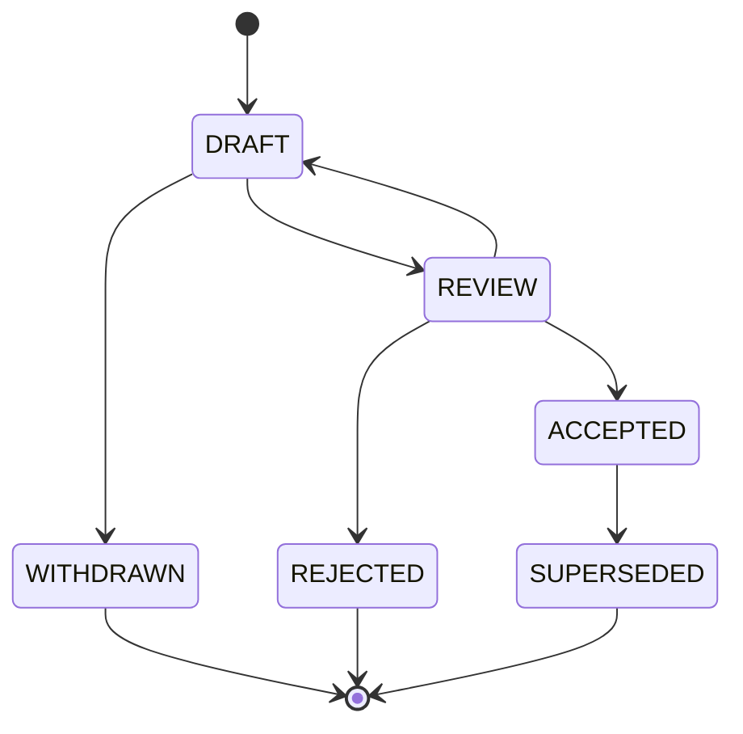

# SAIF Extension Proposal Process v0.2

## Purpose

The SAIF Extension Proposal (SEP) process provides a public, vendor-neutral path for proposing additions to the protocol without fragmenting core semantics.

An extension may introduce an optional object type, field, Provider capability, profile, transport binding, or error code. It must not silently redefine existing SAIF objects, authorization rules, lifecycle states, or settlement semantics.

## Principles

1. Public standard first.
2. Vendor neutral.
3. AI model neutral.
4. Provider neutral.
5. Implementation independent.
6. Backward compatibility is explicit.
7. Extensions include examples and conformance vectors.
8. Commercial product behavior is not standardized as core protocol behavior.

## When a Proposal Is Required

A SEP is required for:

- a new standard object or object type;
- a new optional field in a core object;
- a new lifecycle state or transition;
- a new standard Provider capability;
- a new transport binding or protocol profile;
- a new reserved error category or code range; or
- a change that affects interoperability between implementations.

Documentation corrections that do not alter meaning may use the normal Patch process without a SEP.

## Proposal Structure

Each proposal should contain:

| Section | Requirement |
| --- | --- |
| SEP number | Assigned stable identifier such as `SEP-0001`. |
| Title | Concise name for the extension. |
| Status | Current proposal state. |
| Authors | Public contacts responsible for the proposal. |
| Summary | Short description of the proposed capability. |
| Motivation | Interoperability problem the proposal solves. |
| Specification | Normative objects, fields, states, or behavior. |
| Compatibility | Required MAJOR, MINOR, or PATCH impact. |
| Security and privacy | Risks and required safeguards. |
| Alternatives | Other approaches considered. |
| Examples | Vendor-neutral example data. |
| Conformance vectors | Valid and invalid cases. |
| Reference implementation | Optional and non-normative. |

A proposal must not require a reference implementation to define its normative meaning.

## Proposal Lifecycle



### DRAFT

The author is developing the proposal. The proposal is public but not approved for implementation claims.

### REVIEW

The proposal is complete enough for technical, compatibility, security, privacy, and governance review.

### ACCEPTED

The proposal has consensus for inclusion in a specified SAIF version. Acceptance does not make a commercial implementation normative.

### REJECTED

The proposal does not meet protocol requirements or lacks sufficient interoperability value.

### WITHDRAWN

The author has withdrawn the proposal before acceptance.

### SUPERSEDED

A later accepted proposal replaces the extension. The superseding SEP must be identified.

## Extension Namespaces

Core SAIF names and `SAIF-` error code ranges are reserved for accepted standard specifications.

All standard, experimental, and private extensions MUST use a lowercase
reverse-domain namespace controlled by the extension author. Namespace labels
use the preferred [RFC 1035](https://www.rfc-editor.org/rfc/rfc1035.html)
syntax: every label is 1 to 63 ASCII characters,
starts with a lowercase letter, ends with a lowercase letter or digit, and uses
only lowercase letters, digits, or interior hyphens. A namespace contains at
least two labels and is at most 253 characters in presentation form.

Example namespace and extension identifier:

```text
namespace: org.example
extension_id: org.example.document-priority
```

The Extension ID uses the same label grammar. It MUST begin with the complete
namespace followed by `.` and an extension-local name.

An extension namespace:

- must not claim to be a core SAIF field or capability;
- must not change the meaning of a core field;
- must be safe for an implementation to ignore when declared optional; and
- must document the organization responsible for it.

The `org.saif` namespace is reserved for extensions accepted through this
proposal process. Private or experimental extensions MUST NOT use it. Hyphen-only
identifiers such as `x-organization-capability` are not valid v0.3 namespaces.

## Review Criteria

A proposal is evaluated on:

- demonstrated interoperability need;
- clarity and testability;
- compatibility impact;
- vendor and Provider neutrality;
- AI-model independence;
- security and privacy impact;
- consistency with authorization and lifecycle models;
- availability of valid and invalid conformance vectors; and
- ability to implement without a commercial dependency.

## Versioning Impact

The proposal must classify its version impact using the [SAIF Protocol Versioning Strategy](protocol-versioning.md).

- Breaking semantics require a Major version.
- Backward-compatible optional capability requires a Minor version.
- Non-semantic correction requires a Patch version.

## Adoption

Implementations may experiment with namespaced proposals before acceptance, but must not advertise those features as core SAIF conformance. Once accepted, the proposal identifies the first SAIF version in which its behavior becomes normative.
