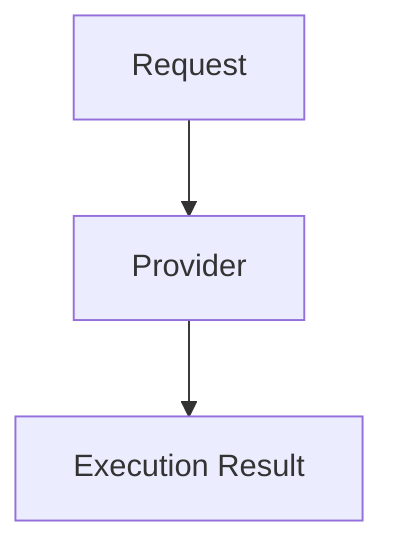

# SAIF Provider Interface

## Overview

Provider represents a system capable of executing SAIF requests.

A Provider may be a commerce service, document system, payment service, robotics platform, or another real-world execution system. SAIF defines a common interaction model without prescribing how the Provider implements its work.

## Unified Model

```text
Request
   ↓
Provider
   ↓
Execution Result
```



In a complete lifecycle, a Provider receives an Order generated from an authorized Request. The simplified model above emphasizes the stable boundary: structured business intent enters a Provider, and a structured execution result returns.

## Provider Responsibilities

A conforming Provider should:

- declare the action types it supports;
- accept only requests or orders it can execute;
- preserve SAIF object identifiers and references;
- return a structured Execution status;
- distinguish pending, successful, and failed outcomes; and
- avoid changing the owner’s Authorization or the Agent’s identity.

## Document Provider

Action:

`DOCUMENT_PRINT`

A Document Provider accepts an authorized print Order and returns an Execution result describing whether printing is pending, in progress, completed, or failed.

## Commerce Provider

Action:

`PURCHASE_ORDER`

A Commerce Provider accepts an authorized Purchase Order and returns an Execution result such as order acceptance, fulfillment progress, shipment, completion, or failure.

## Payment Provider

Action:

`PAYMENT`

A Payment Provider may represent payment execution or return a payment reference. SAIF v0.1 defines the object boundary only; it does not include payment code or require a specific payment rail.

## Robot Provider

Action:

`MAINTENANCE`

A Robot Provider accepts an authorized maintenance Order and returns an Execution result for the requested robot or machine operation.

## Minimal Provider Input

A Provider needs enough information to identify:

- the Order to execute;
- the original Request;
- the verified Authorization;
- the requested action and details; and
- any protocol-neutral metadata required for routing.

## Minimal Provider Output

A Provider returns an Execution object containing:

- Execution ID;
- execution type;
- creation time;
- metadata;
- Order ID;
- Provider ID;
- status; and
- an optional structured result.

## Provider Independence

SAIF does not require a particular cloud, AI vendor, marketplace, payment processor, logistics network, printer, or robotics system. Provider-specific details may be carried in `metadata` or `result`, while the core object envelope and reference chain remain portable.

## v0.1 Boundaries

This document defines a conceptual interface. It does not define HTTP endpoints, SDKs, authentication, service discovery, callbacks, webhooks, or MCP tools.
