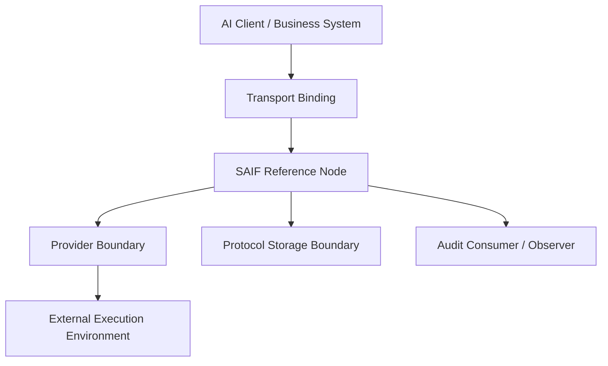
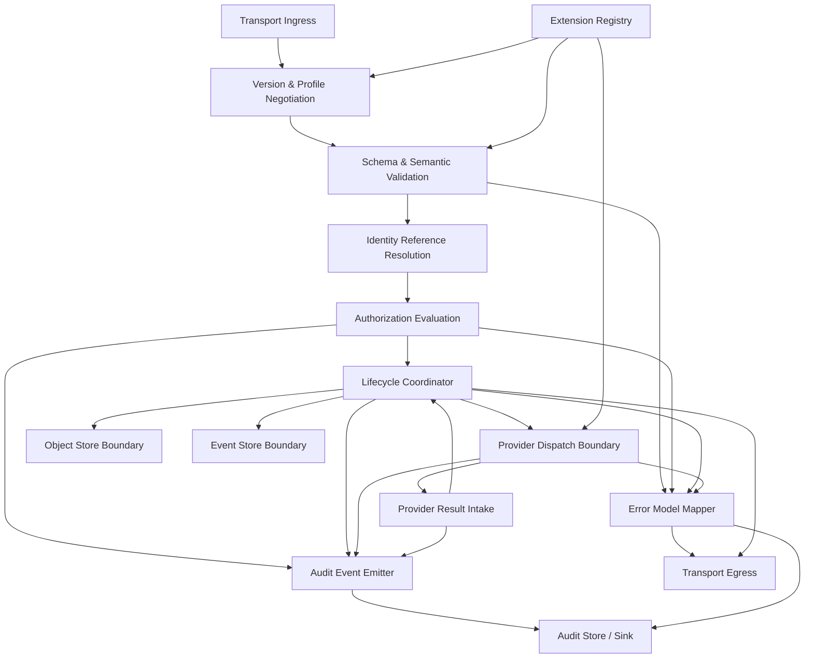

# SAIF Protocol Reference Architecture v0.3

## Status

This document is a **design draft** for SAIF Protocol v0.3. It defines a logical reference architecture and module boundaries for interoperable implementations.

It does not define runtime code, a commercial platform, a payment implementation, an MCP Adapter, an authentication provider, or a mandatory deployment topology.

Normative terms such as **MUST**, **SHOULD**, and **MAY** describe intended v0.3 interoperability requirements. They remain draft requirements until accepted through the SAIF governance process.

## Purpose

The SAIF Reference Node describes how an implementation can receive protocol objects, validate versions and schemas, enforce authorization and lifecycle rules, exchange execution data with Providers, record audit evidence, and expose transport-independent operations.

The architecture preserves the boundaries established in v0.1 and v0.2:

- the Business Object Model remains the portable semantic core;
- transport connectivity does not redefine SAIF objects;
- AI client authentication does not replace Party, Agent, or Authorization semantics;
- Provider internals remain outside the protocol core;
- extensions cannot silently redefine normative behavior;
- errors and audit events remain portable; and
- storage technology is an implementation choice.

## Design Principles

1. **Protocol first:** architecture exists to preserve public protocol semantics.
2. **Vendor neutral:** no module requires a specific commercial product.
3. **AI model neutral:** Agents may originate from any model or robotics system.
4. **Provider neutral:** execution systems implement capabilities without changing core semantics.
5. **Transport independent:** HTTP, MCP, messaging, and local invocation are bindings, not the protocol itself.
6. **Storage independent:** relational, document, event, or other stores may be used when they preserve required behavior.
7. **Authorization based:** a human or organization remains the accountable owner.
8. **Auditable:** material decisions and state transitions produce correlated evidence.
9. **Extension safe:** optional extensions are isolated, declared, and ignorable when specified as optional.
10. **No commercial implementation:** this architecture does not define marketplace, wallet, payment, or product behavior.

## SAIF Reference Node

### Definition

A **SAIF Reference Node** is a logical protocol boundary that performs or coordinates the minimum functions required to process SAIF business objects consistently.

A Reference Node may be deployed as one process, multiple services, embedded libraries, or another architecture. Conformance depends on observable protocol behavior, not deployment shape.

### Context Architecture

```text
AI Client / Business System
             ↓
Transport Binding (MCP / API / Message)
             ↓
        SAIF Reference Node
             ↓
Provider Boundary / Provider System
             ↓
External Execution Environment
```



The AI client may use MCP, an API, a message bus, or another binding. The Provider may represent printing, robotics, services, commerce, payments, or a future capability. Neither side changes the meaning of SAIF objects.

## Internal Logical Architecture



The diagram is logical. Modules may be combined or separated as long as the implementation preserves the boundaries and conformance behavior described below.

## Core Module Boundary

The **Core Module Boundary** contains protocol semantics that must remain portable across implementations.

### 1. Version and Profile Negotiation

Responsibilities:

- read the declared `saif_version`;
- compare it with supported versions and profiles;
- reject unsupported or incompatible Major versions;
- declare enabled optional extensions; and
- prevent silent version downgrade.

Must not:

- infer compatibility solely from transport version;
- reinterpret unknown required semantics; or
- let a Provider override the negotiated protocol version.

### 2. Schema and Semantic Validation

Responsibilities:

- validate core objects against the applicable JSON Schema;
- enforce required common fields;
- validate enumerations and reference shapes;
- apply semantic rules not expressible in JSON Schema; and
- return Standard Error Model results on failure.

Schema validity is necessary but not sufficient. A schema-valid object may still violate authorization, reference integrity, or lifecycle rules.

### 3. Identity Reference Resolution

Responsibilities:

- resolve Party, Agent, Owner, and Provider references used by protocol objects;
- confirm that referenced identities are active and internally consistent; and
- preserve the distinction between AI client identity, Agent identity, and accountable Owner identity.

This module defines a resolution boundary, not an identity provider. SAIF does not require a particular identity, credential, directory, or authentication system.

### 4. Authorization Evaluation

Responsibilities:

- bind an Authorization to its Owner and Agent;
- verify that scope, limits, and rules permit the requested action;
- produce an auditable authorization outcome; and
- prevent an Agent or Provider from expanding its own authority.

Must not:

- treat transport authentication as business authorization;
- delegate policy meaning to Provider-specific metadata; or
- create an Order when required authorization is absent or invalid.

### 5. Lifecycle Coordinator

Responsibilities:

- enforce Request, Order, Execution, and Settlement state machines;
- maintain cross-object references;
- reject illegal transitions;
- prevent failed or cancelled activity from appearing successful; and
- emit an Audit Event for material state changes.

The coordinator governs observable state semantics. It does not prescribe Provider workflow internals.

### 6. Error Model Mapper

Responsibilities:

- express protocol failures using the SAIF Standard Error Model;
- assign stable categories and codes;
- distinguish retryable from non-retryable failures;
- associate errors with objects and correlation IDs; and
- remove sensitive implementation detail from portable errors.

Transport-native errors may wrap or carry SAIF errors but must not replace their semantic meaning.

### 7. Audit Event Emitter

Responsibilities:

- record actor, action, object, outcome, authorization, states, and correlation;
- emit events in object and correlation order;
- minimize sensitive data; and
- support independent audit consumption.

The core requires portable audit data, not a particular ledger, database, or cryptographic proof system.

## Adapter Boundaries

Adapters translate between external systems and the Core Module Boundary. They are not permitted to redefine core semantics.

| Adapter boundary | Responsibility | Excluded responsibility |
| --- | --- | --- |
| Transport Binding | Carry SAIF operations and objects over MCP, HTTP, messaging, or local calls. | Authorization meaning, lifecycle meaning, Provider execution. |
| Identity Resolver | Resolve implementation-specific Party, Agent, Owner, or Provider references. | Changing owner relationships or authorization scope. |
| Provider Adapter | Map Orders to Provider capabilities and return Execution results. | Creating authority, changing core states outside valid transitions. |
| Storage Adapter | Persist and retrieve objects, events, errors, and extension declarations. | Redefining schemas, reference integrity, or retention semantics. |
| Audit Sink | Consume or retain portable Audit Events. | Altering the source protocol outcome. |

## Extension Boundary

### Purpose

The Extension Boundary permits optional capabilities without fragmenting the interoperable core.

Extensions are governed by the [SAIF Extension Proposal Process](proposal-process.md) and the [Protocol Versioning Strategy](protocol-versioning.md).

### Extension Registry

A Reference Node should maintain a logical registry containing:

- extension identifier and namespace;
- extension version;
- compatibility range;
- required or optional status;
- affected object types or Provider capabilities;
- schema or validation references; and
- proposal status when standardized through a SEP.

The registry may be static configuration, discovered capabilities, or persisted data. No central commercial registry is required.

### Allowed Extension Points

Extensions may add:

- optional namespaced metadata;
- new optional object types through an accepted proposal;
- optional Provider capability descriptors;
- additional validation rules for extension-owned fields;
- transport binding profiles; and
- namespaced error and audit event types.

### Prohibited Extension Behavior

An extension must not:

- remove or weaken a core required field;
- redefine an existing object or state;
- bypass Owner authorization;
- convert an invalid transition into a valid one;
- allocate unapproved core `SAIF-` codes;
- make a commercial vendor required for core conformance; or
- hide required protocol evidence inside opaque Provider data.

### Unknown Extension Handling

- An unknown **optional** extension may be ignored only when the object remains valid and meaningful without it.
- An unknown **required** extension must cause a version or extension compatibility error.
- Ignoring an optional extension must not change authorization, lifecycle, or settlement semantics.
- Implementations should expose supported extensions through capability discovery.

## Storage Model

### Logical Stores

The Reference Node defines logical storage responsibilities rather than a database technology.

| Logical store | Contents | Required properties |
| --- | --- | --- |
| Object Store | Party references, Agents, Requests, Authorizations, Orders, Executions, Settlements. | ID lookup, version retention, reference integrity. |
| Transition Store | State changes for lifecycle objects. | Ordered history, previous/new state, actor, timestamp. |
| Audit Event Store | Portable SAIF Audit Events. | Append-oriented retention, correlation queries, integrity controls. |
| Error Store | Standard Error Model records. | Object and correlation lookup, safe diagnostics. |
| Extension Registry Store | Extension declarations and compatibility metadata. | Namespace uniqueness, version lookup, enabled/required status. |
| Idempotency Store | Accepted operation keys and outcomes. | Replay detection and deterministic response recovery. |

These logical stores may share one physical database or use different technologies.

### Record Model

Core business objects should be treated as versioned records. Implementations may store current projections for efficient reads, but must retain enough history to reconstruct material state transitions and audit outcomes.

A minimum stored object record should preserve:

- object type and ID;
- declared SAIF version;
- canonical object payload or equivalent lossless representation;
- creation and update timestamps;
- current protocol state where applicable;
- related object references;
- correlation ID where applicable; and
- enabled required extensions.

### Mutation and History

Implementations may use immutable object versions, append-only events, transactional snapshots, or another model. Observable behavior must ensure:

1. illegal state transitions cannot overwrite valid history;
2. concurrent transitions do not create two conflicting terminal outcomes;
3. an Order remains traceable to its Request and Authorization;
4. an Execution remains traceable to its Order and Provider;
5. a Settlement remains traceable to its Execution; and
6. audit records remain attributable and ordered.

### Atomicity Expectations

When one protocol operation creates related state, the implementation should commit the business object change, transition record, and Audit Event atomically or provide equivalent recovery behavior.

Examples include:

- Request `AUTHORIZED → CONVERTED` with Order `CREATED`;
- Execution `COMPLETED` with Order `FULFILLED`; and
- Settlement state change with its Audit Event.

SAIF does not prescribe distributed transaction technology. An implementation must document how it prevents or repairs partial protocol outcomes.

### Retention and Privacy

Storage profiles should define:

- retention periods by object and event type;
- deletion or anonymization behavior where legally required;
- preservation of non-sensitive reference integrity;
- access boundaries for audit and error data; and
- treatment of extension data.

Private prompts, credentials, private keys, and unnecessary personal data must not be stored in portable SAIF objects or Audit Events.

## API Surface Draft

### Status

This section defines abstract operations and an illustrative HTTP-style mapping. The operations are transport-binding candidates, not a mandatory REST API.

MCP, message, and local bindings may expose equivalent operations while preserving the same inputs, outputs, errors, idempotency, and lifecycle semantics.

### Common Operation Context

Every state-changing operation should carry or resolve:

- `saif_version`;
- correlation ID;
- idempotency key;
- actor reference;
- Agent and Owner references when applicable;
- required extension declarations; and
- transport-specific authentication context kept outside the business object.

### Discovery Operations

| Abstract operation | Illustrative mapping | Result |
| --- | --- | --- |
| `DescribeNode` | `GET /saif` | Node profile and implementation identity. |
| `ListVersions` | `GET /saif/versions` | Supported SAIF versions. |
| `ListCapabilities` | `GET /saif/capabilities` | Core profiles, Provider capabilities, and extensions. |
| `ListExtensions` | `GET /saif/extensions` | Enabled optional and required extensions. |

Discovery output must not imply authorization to invoke a capability.

### Object Operations

| Abstract operation | Illustrative mapping | Result |
| --- | --- | --- |
| `CreateRequest` | `POST /saif/requests` | Request in `DRAFT` or `SUBMITTED`. |
| `GetObject` | `GET /saif/objects/{type}/{id}` | Current object representation. |
| `GetObjectHistory` | `GET /saif/objects/{type}/{id}/history` | Ordered state and version history. |
| `TransitionRequest` | `POST /saif/requests/{id}/transitions` | Updated Request or Standard Error. |
| `EvaluateAuthorization` | `POST /saif/authorization-evaluations` | Auditable authorization outcome. |
| `ConvertRequest` | `POST /saif/requests/{id}/conversion` | Request `CONVERTED` and Order `CREATED`. |
| `RecordExecution` | `POST /saif/executions` | Execution linked to an Order and Provider. |
| `TransitionExecution` | `POST /saif/executions/{id}/transitions` | Updated Execution or Standard Error. |
| `RecordSettlement` | `POST /saif/settlements` | Settlement linked to an Execution. |
| `TransitionSettlement` | `POST /saif/settlements/{id}/transitions` | Updated Settlement or Standard Error. |

Implementations may expose narrower profile-specific surfaces. They must not allow clients to bypass authorization or create illegal state transitions by calling lower-level storage operations.

### Provider Operations

| Abstract operation | Illustrative mapping | Result |
| --- | --- | --- |
| `SubmitOrderToProvider` | Binding-specific Provider call | Provider acceptance or Standard Error. |
| `RecordProviderProgress` | `POST /saif/executions/{id}/provider-events` | Valid Execution progress transition. |
| `RecordProviderResult` | `POST /saif/executions/{id}/provider-result` | Terminal Execution result. |

Provider operations are exposed only at the Provider Boundary. A Provider must not submit owner Authorization on behalf of an Agent unless it is independently authorized to do so.

### Audit and Error Operations

| Abstract operation | Illustrative mapping | Result |
| --- | --- | --- |
| `QueryAuditEvents` | `GET /saif/audit-events` | Events filtered by object or correlation ID. |
| `GetError` | `GET /saif/errors/{id}` | Standard Error record. |

Access to audit and error data must follow data minimization and authorization policy. Public protocol definition does not imply public record access.

### API Response Rules

1. A transport success does not prove business success.
2. Protocol failures return or reference a Standard Error object.
3. State-changing operations are idempotent within an implementation-defined retention window.
4. Replayed operations must not create duplicate Orders, Executions, Settlements, or Audit Events.
5. Responses preserve object IDs, correlation IDs, and declared SAIF version.
6. Asynchronous execution returns a non-terminal Execution state rather than a false success.

## Security Model Draft

### Trust Boundaries

The architecture separates five trust zones:

1. **Client Zone:** AI clients and business systems are untrusted protocol input sources.
2. **Transport Zone:** connectors authenticate transport peers but do not decide business authorization.
3. **Core Protocol Zone:** validation, authorization, lifecycle, error, and audit semantics are enforced.
4. **Provider Zone:** Providers are trusted only for their declared capabilities and returned evidence.
5. **Storage and Audit Zone:** persisted objects and events require integrity and access controls.

### Security Invariants

- An Agent cannot become its own accountable Owner through input data.
- Transport authentication cannot substitute for SAIF Authorization.
- No Order is created from an unauthorized Request.
- No invalid lifecycle transition is persisted as valid.
- Provider results cannot rewrite the original Request or Authorization.
- An unknown required extension fails closed.
- Duplicate state-changing operations do not create duplicate commitments.
- Audit Events identify the actor, object, outcome, and correlation.
- Portable errors and audit records do not expose secrets.
- Version negotiation resists silent downgrade.

### Threats and Required Controls

| Threat | Required architectural control |
| --- | --- |
| Malformed or adversarial Agent input | Schema and semantic validation before lifecycle processing. |
| Confused deputy | Explicit Owner-Agent-Authorization binding and scoped Provider dispatch. |
| Authorization substitution | Authorization reference integrity and auditable evaluation. |
| Replay or duplicate delivery | Idempotency keys and deterministic prior-result recovery. |
| Illegal state mutation | Central lifecycle transition validation and ordered history. |
| Provider impersonation | Provider reference resolution and binding-level peer verification. |
| False Provider success | Evidence-linked Execution result and state validation. |
| Extension injection | Namespace validation, capability negotiation, and fail-closed required extensions. |
| Version downgrade | Explicit supported-version negotiation and recorded selected version. |
| Sensitive data leakage | Data minimization, field filtering, and safe Standard Errors. |
| Audit tampering | Access controls, ordering, integrity checks, and optional cryptographic proofs. |
| Resource exhaustion | Binding-level size limits, quotas, timeouts, and safe rejection. |

### Authentication Boundary

SAIF defines which protocol identities and authorizations must be resolved, but it does not mandate an authentication provider or credential format.

A binding profile should document:

- how transport peers are authenticated;
- how authenticated peers map to Party, Agent, or Provider references;
- how credentials are rotated and revoked;
- how replay is prevented; and
- which claims remain outside SAIF business semantics.

### Cryptographic Agnosticism

Implementations may use signatures, hashes, secure channels, hardware keys, or immutable ledgers. Core conformance must not require one commercial or cryptographic platform unless a future accepted security profile makes specific behavior normative.

### Provider Security

Provider adapters should receive only the information needed to execute an authorized Order. They must not receive unrestricted owner credentials through portable SAIF objects.

Provider results should include enough reference and evidence data to support Execution validation and audit correlation without exposing confidential internals.

### Extension Security

Every extension proposal should analyze:

- new authority or data exposure;
- compatibility and downgrade risks;
- behavior when the extension is unknown;
- Provider trust changes;
- audit requirements; and
- new conformance vectors.

Extensions that weaken a core security invariant are not conforming extensions.

## Conformance Expectations for a Reference Node

A v0.3 Reference Node profile should demonstrate:

1. supported-version and capability discovery;
2. core object schema validation;
3. valid and invalid lifecycle transitions;
4. auditable authorization evaluation;
5. Provider-independent Execution recording;
6. Standard Error output;
7. Audit Event output and correlation;
8. unknown optional and required extension behavior;
9. replay-safe state-changing operations; and
10. lossless retrieval of linked protocol objects.

These expectations should be expressed as public conformance vectors rather than a required reference runtime.

## Explicit Non-Goals

This reference architecture does not define:

- a deployable SAIF server;
- source code or SDKs;
- a commercial platform;
- payment, wallet, marketplace, or settlement logic;
- an MCP Adapter or tool manifest;
- an authentication or identity provider;
- a mandatory database;
- a blockchain or token;
- Provider discovery economics; or
- legal or regulatory compliance for a specific jurisdiction.

## Open Design Questions

The following topics require proposal and conformance review before v0.3 stabilization:

- canonical serialization for signing and hashing;
- capability discovery object shape;
- idempotency key scope and retention;
- required extension declaration format;
- asynchronous Provider callback binding;
- pagination and filtering semantics for audit queries;
- object revision and optimistic concurrency fields; and
- minimum security profiles for public-network bindings.
