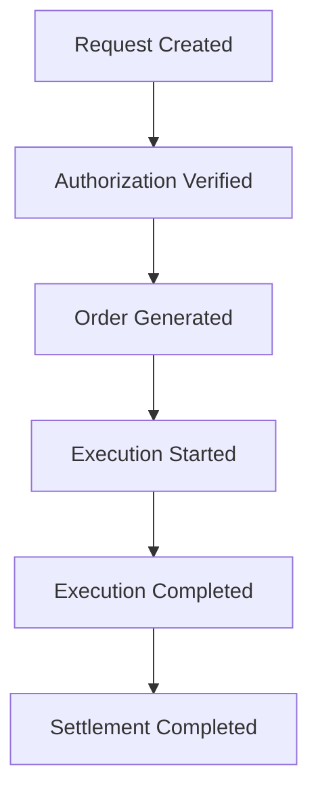

# SAIF Request Lifecycle

## Flow

```text
Request Created
       ↓
Authorization Verified
       ↓
Order Generated
       ↓
Execution Started
       ↓
Execution Completed
       ↓
Settlement Completed
```



Different providers may implement different execution mechanisms.

SAIF standardizes the objects and their relationships rather than prescribing provider internals.

## Lifecycle Stages

### 1. Request Created

An Agent converts a human or organizational requirement into a structured Request. No commercial commitment exists at this stage.

Required evidence:

- Request ID;
- acting Agent ID;
- business request type; and
- structured requirement.

### 2. Authorization Verified

The system confirms that an Authorization applies to the Agent and requested activity. Scope, limits, rules, and owner identity are evaluated before an Order is generated.

If authorization cannot be verified, the lifecycle stops without creating a business commitment.

### 3. Order Generated

An authorized Request becomes an Order. The Order references the Request and Authorization so the commitment can be traced to both the original intent and the owner’s permission.

### 4. Execution Started

An eligible provider accepts the Order and creates an Execution object with an initial status such as `pending` or `in_progress`.

### 5. Execution Completed

The provider reports a terminal execution result. A successful result may represent shipment, printing, robot operation, or service completion. A failed result records the failure without claiming successful settlement.

### 6. Settlement Completed

A Settlement object records the final outcome, such as a payment reference, refund, invoice, or accounting record. SAIF represents the result but does not process the payment or prescribe the settlement mechanism.

## Lifecycle Invariants

1. A Request must identify the acting Agent.
2. An Order must not be generated without verified Authorization.
3. An Order must reference both its Request and Authorization.
4. An Execution must reference its Order and Provider.
5. A Settlement must reference the relevant Execution.
6. Providers may extend internal behavior, but must preserve SAIF object references.
7. Rejected or failed activity should remain auditable without being represented as successful execution or settlement.

## Out of Scope

The lifecycle does not define network transport, retries, provider discovery, payment rails, marketplace matching, or user interfaces in v0.1.
