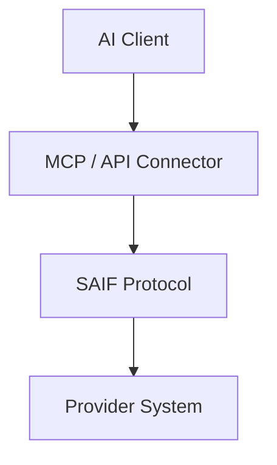

# SAIF Protocol and MCP Boundary

## Purpose

This document clarifies the relationship between SAIF Protocol and the Model Context Protocol (MCP).

SAIF and MCP solve different layers of the AI-to-provider interaction. They may be used together, but neither depends on the other.

## MCP Responsibility

MCP provides:

- AI client connectivity;
- Tool discovery; and
- Tool invocation transport.

Examples of AI clients include:

- ChatGPT;
- Claude; and
- Other AI clients.

MCP can expose a capability to an AI client and carry the tool invocation and result. MCP does not, by itself, define SAIF business objects, authorization semantics, business commitments, Provider execution states, or settlement lifecycles.

---

## SAIF Responsibility

SAIF defines:

- Business Objects;
- Request lifecycle;
- Authorization model;
- Execution model; and
- Settlement model.

SAIF determines the portable meaning of the business interaction after a capability is invoked. It does not require a specific AI client, transport, MCP server, API framework, or Provider implementation.

---

## Core Principle

MCP answers:

> “How does AI call a capability?”

SAIF answers:

> “What happens after AI calls that capability?”

## Architecture

```text
AI Client
    ↓
MCP / API Connector
    ↓
SAIF Protocol
    ↓
Provider System
```



## Boundary Rules

1. SAIF business objects must remain usable without MCP.
2. An MCP tool may carry SAIF objects but must not redefine their normative semantics.
3. A non-MCP API or message transport may carry the same SAIF objects.
4. AI client identity is not a substitute for Party, Agent, or Authorization objects.
5. Provider-specific tool parameters should be mapped to portable SAIF objects at the connector boundary.
6. Tool invocation success does not imply business Execution or Settlement success.
7. MCP authentication or transport security does not replace SAIF authorization evaluation.

## Example Interaction

1. An AI client discovers a `DOCUMENT_PRINT` tool through MCP.
2. The AI client invokes the tool with a structured requirement.
3. The connector creates or forwards a SAIF Request.
4. SAIF verifies Authorization and creates an Order.
5. A Document Provider performs the Execution.
6. SAIF records the Execution and Settlement objects.
7. The connector returns an appropriate result to the AI client.

The MCP exchange may end while the business lifecycle continues asynchronously. SAIF object IDs allow later Provider updates to remain connected to the original Request.

## Out of Scope

SAIF v0.1 does not define an MCP Adapter, MCP server, tool manifest, authentication provider, or runtime implementation. A future transport binding may define how SAIF objects are represented over MCP without changing the core protocol model.
