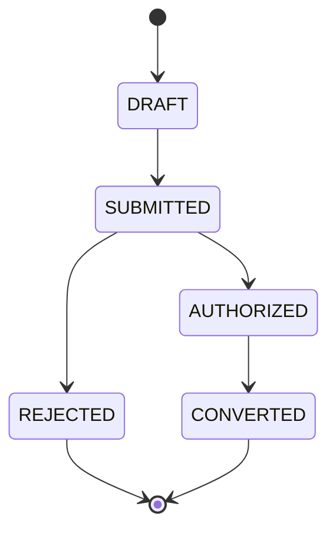
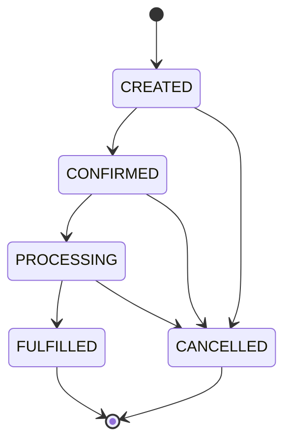
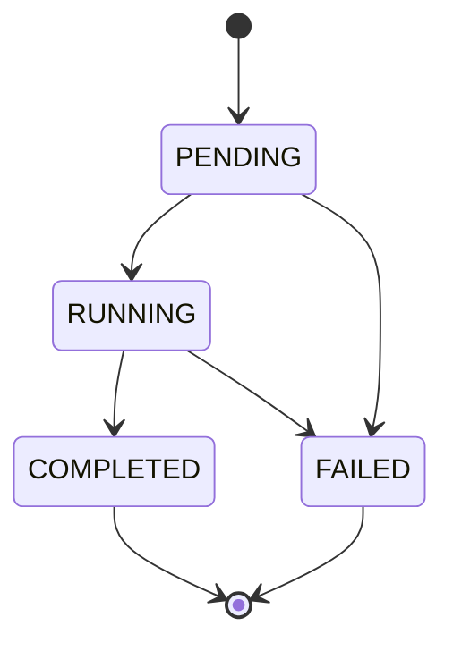
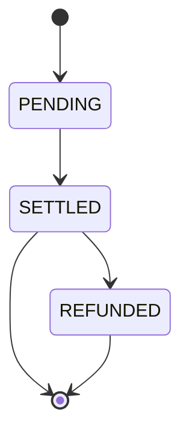

# SAIF Protocol State Model

## Purpose

This document defines standard lifecycle states for SAIF Request, Order, Execution, and Settlement objects.

The states are business-neutral. They apply to commerce, printing, robotics, services, payments, and future Provider capabilities without prescribing how a Provider performs its work.

State names are uppercase protocol values. A transition must preserve the relevant SAIF object IDs and audit references.

## Request Lifecycle

Request represents an intention submitted by an Agent or Party.

### States

- `DRAFT` — the Request is being prepared and has not been submitted.
- `SUBMITTED` — the Request has been submitted for authorization evaluation.
- `AUTHORIZED` — a valid Authorization permits the Request to proceed.
- `REJECTED` — the Request was denied or could not be authorized.
- `CONVERTED` — the authorized Request has been converted into an Order.

### Transitions



Valid transition paths:

```text
DRAFT → SUBMITTED → AUTHORIZED → CONVERTED
DRAFT → SUBMITTED → REJECTED
```

`REJECTED` and `CONVERTED` are terminal Request states in v0.1.

## Order Lifecycle

Order represents a business commitment.

### States

- `CREATED` — the Order has been generated from an authorized Request.
- `CONFIRMED` — an eligible Provider or responsible Party has accepted the commitment.
- `PROCESSING` — fulfillment or preparation is in progress.
- `FULFILLED` — the committed business outcome has been delivered.
- `CANCELLED` — the Order was cancelled before fulfillment.

### Transitions



`FULFILLED` and `CANCELLED` are terminal Order states in v0.1.

## Execution Lifecycle

Execution represents real-world action completion.

### States

- `PENDING` — the Provider has not started the action.
- `RUNNING` — the Provider is performing the action.
- `COMPLETED` — the action completed successfully.
- `FAILED` — the action could not be completed.

### Transitions



`COMPLETED` and `FAILED` are terminal Execution states in v0.1.

## Settlement Lifecycle

Settlement represents financial or resource reconciliation.

### States

- `PENDING` — reconciliation has been created but is not final.
- `SETTLED` — the financial or resource record has been reconciled.
- `REFUNDED` — a previously settled outcome has been reversed or refunded.

### Transitions



`REFUNDED` is terminal in v0.1. A `SETTLED` object may remain final when no refund or reversal occurs.

## Cross-Object Lifecycle

```text
Request AUTHORIZED
        ↓
Request CONVERTED + Order CREATED
        ↓
Order CONFIRMED
        ↓
Execution PENDING → RUNNING
        ↓
Execution COMPLETED + Order FULFILLED
        ↓
Settlement PENDING → SETTLED
```

A failed or cancelled path must not be represented as successful completion. Implementations may record additional diagnostic detail in `metadata`, but metadata must not redefine these normative states.

## Provider Independence

The state model describes observable protocol outcomes, not internal Provider workflows. A document system may print, a robotics system may perform maintenance, a service system may complete work, and a payment system may reconcile a payment; each uses the same lifecycle semantics where the corresponding object applies.
